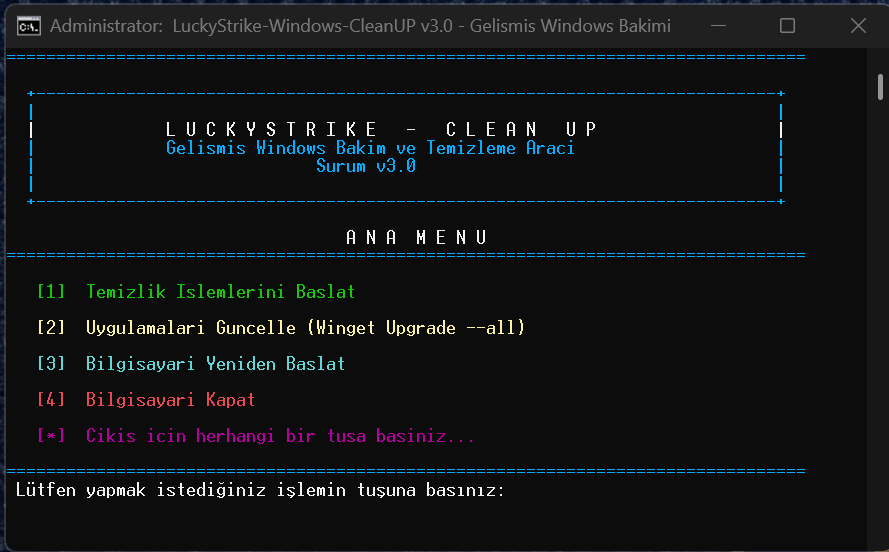

# LuckyStrike-Windows-CleanUP 

An advanced, smart, and highly configurable system maintenance and cleanup automation script for Windows 10 and Windows 11. Built with robust error handling, multi-level logging, and intelligent file locking bypass mechanisms.


---

## 📸 Screenshots

| Execution & Progress | Summary & Exit Prompt |
| :---: | :---: |
|  |  |

---

## ✨ Key Features

- **🧠 Smart Deletion Algorithm:** Logs exact file paths being deleted or bypassed due to active system locks without crashing or spamming the console.
- **📊 5-Level Parametric Logging:** Fully configurable log levels ranging from silent critical errors (`FATAL`) to full file-by-file deletion tracking (`DEBUG`).
- **🛡️ Windows Defender History Cleanup:** Safely takes ownership (`takeown` & `icacls`) of protected scan history folders to completely wipe old threat detection logs.
- **⚡ Background Execution:** Utilizes PowerShell and native Windows tools (`DISM`, `wevtutil`, `ipconfig`) silently in isolated processes.
- **🎮 Interactive Exit Options:** Built-in prompt at completion allowing instant System Reboot (`R`), Shutdown (`S`), or safe exit.

---

## 🧹 What Does It Clean? (16 Steps)

1. **Windows & User Temp Folders** (`C:\Windows\Temp` & `%TEMP%`)
2. **Windows Update Cache** (`SoftwareDistribution\Download`)
3. **File Explorer Recent Files & Start Menu MRU**
4. **All Recycle Bins Across All Drives**
5. **Windows Event Logs** (System, Application, Security, etc.)
6. **DNS Resolver Cache** (`ipconfig /flushdns`)
7. **Explorer File Access & Frequent Folder History**
8. **Start Menu Recently Installed Apps Tracking**
9. **Crash Reports & Memory Dumps** (`MEMORY.DMP`, `Minidump`, `WER`)
10. **Delivery Optimization Cache**
11. **DirectX & GPU Shader Caches** (NVIDIA, AMD, D3D)
12. **Thumbnail & Icon Caches** (`IconCache.db`, `thumbcache_*.db`)
13. **Windows Prefetch Cache**
14. **ARP & Network Caches** (`NBTSTAT`)
15. **Windows Defender Protection & Scan History**
16. **DISM Component Store Cleanup** (`/StartComponentCleanup`)

---

## 🚀 How to Use

1. Download the latest `Lucky-CleanUP.bat` file from the repository.
2. Right-click the file and select **Run as administrator** *(Required for DISM, Service stops, and Defender history cleanup)*.
3. Sit back and let the automation run.
4. At the end of the process, press:
   - `R` to **Reboot** the PC.
   - `S` to **Shutdown** the PC.
   - **Any other key** to exit cleanly.

---

## ⚙️ Configuration & Parameters

You can customize the script behavior by editing the parameters at the top of the `Lucky-CleanUP.bat` file using any text editor (Notepad):

### Enable / Disable Modules
Set any step to `ON` or `OFF`:
```batch
SET CLEAN_TEMP=ON
SET CLEAN_UPDATE=ON
SET CLEAN_SHADER_CACHE=OFF  :: Example: Disable shader cleanup
